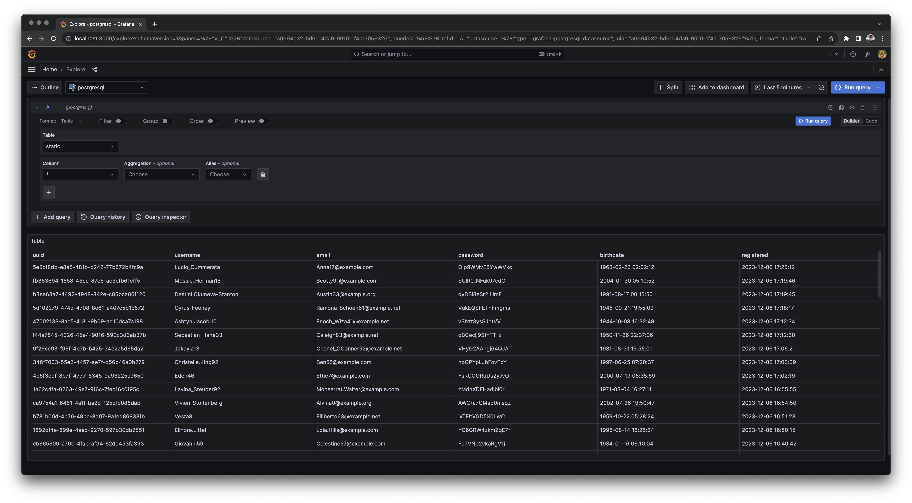

## DGT - Database Generation Tool

### Complete the Configuration File

Before you begin using the scripts, it's essential to update the configuration file located at `/configuration/settings.ini`.

```ini
[$database]
[$database.connection]
# This section contains settings related to the database connection.
# This includes the host, port, and authentication.

[$database.data]
# This includes database and table names, timeouts etc.
# This section contains settings related to the data generation.
```

### Commands

To use the script's functionalities, you can execute the following commands:

```bash
# Create the database and tables for the specified database management systems.
# Example: yarn generate postgres
$ yarn generate <database1> <database2> ...

# Populate the database tables with data.
# Example: yarn populate postgres
$ yarn populate <database1> <database2> ...

# Delete the database.
# Example: yarn destruct postgres
$ yarn destruct <database1> <database2> ...
```

### Examples



